# MFA Methods - Flow Diagrams

**Note**: These diagrams show Django view functions that are called via AJAX from JavaScript on the frontend. The "API" references are actually Django view functions that return `JsonResponse` or `HttpResponse` objects, not separate REST API services.

## 1. Email MFA (Email.py)

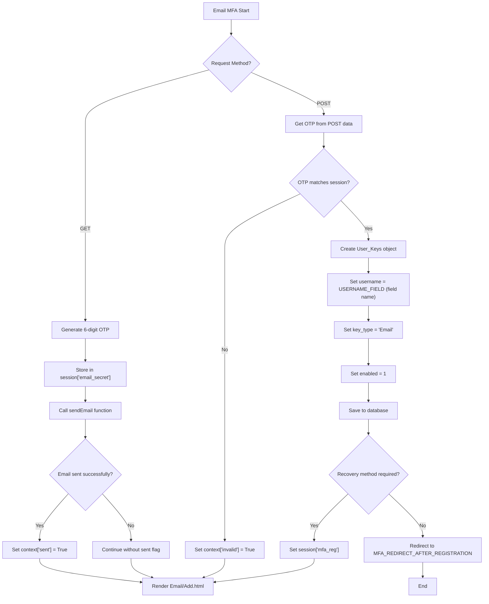

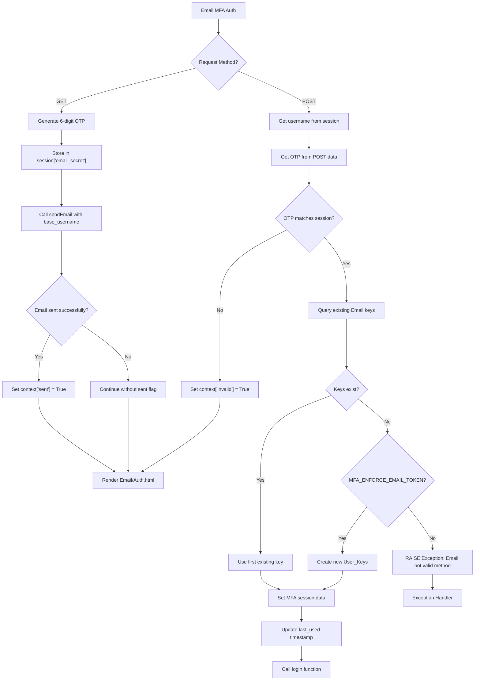

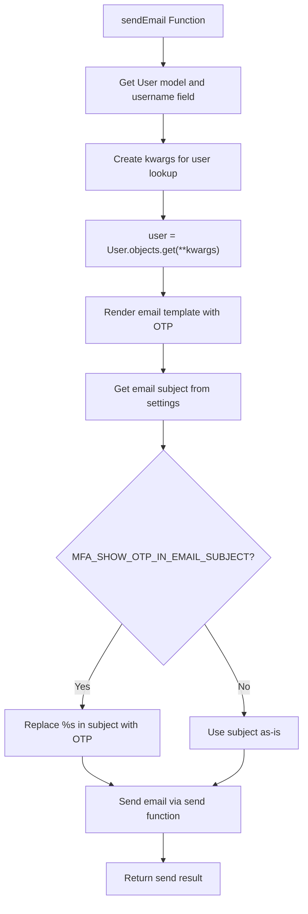
<br>
<br>
<br>

## 2. TOTP MFA (totp.py)

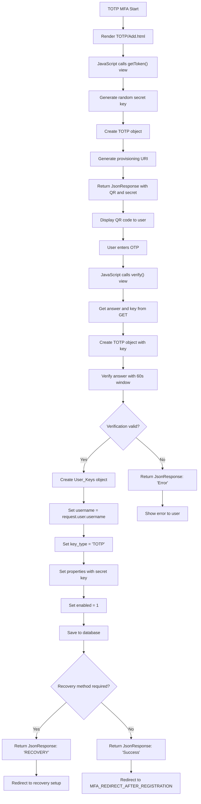

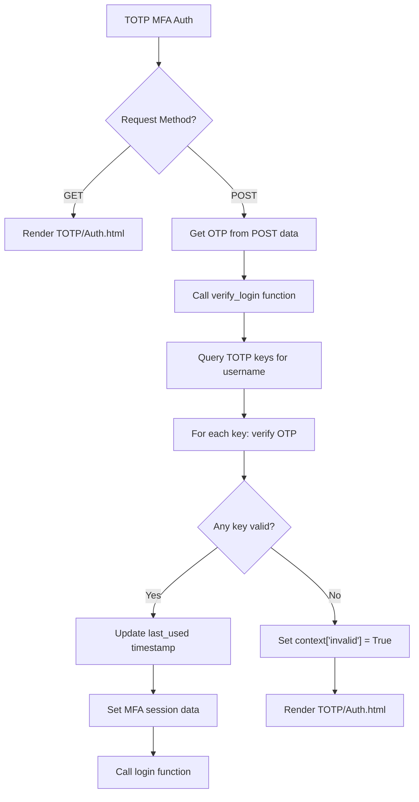

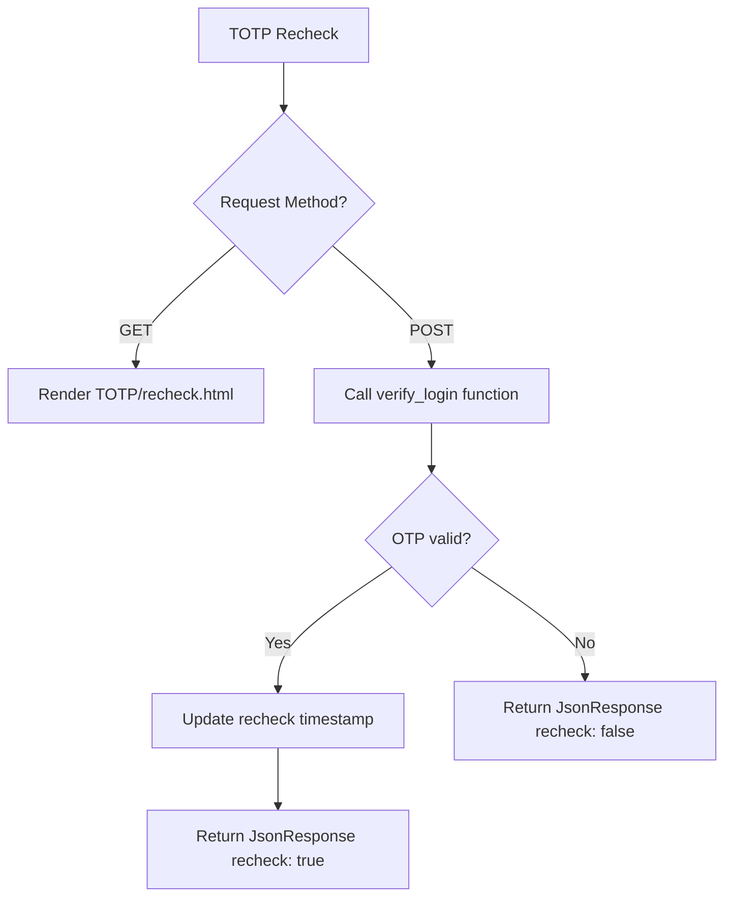
<br>
<br>
<br>

## 3. FIDO2 MFA (FIDO2.py)

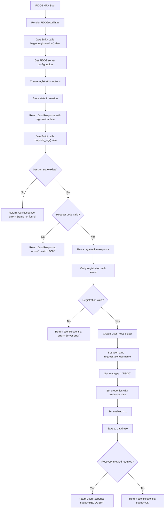

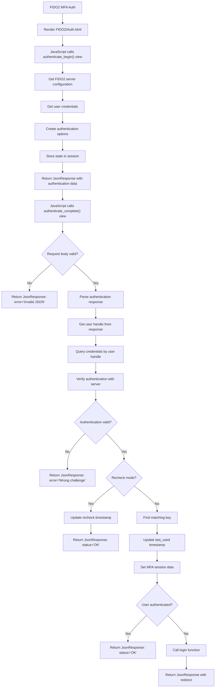

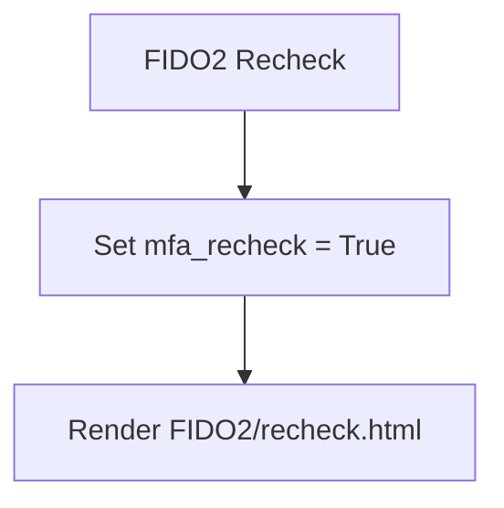
<br>
<br>
<br>

## 4. U2F MFA (U2F.py)

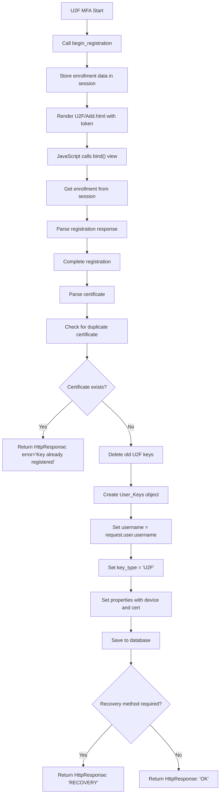

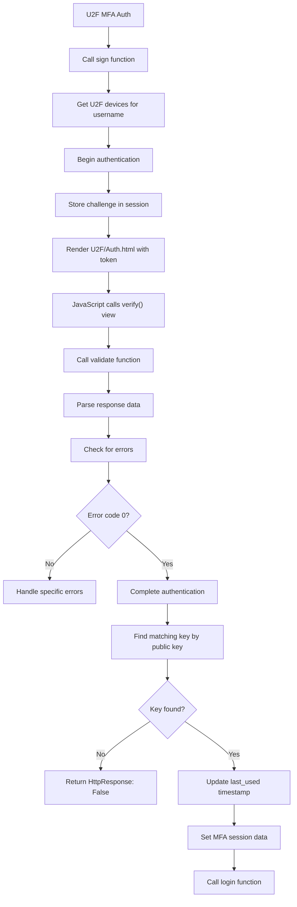

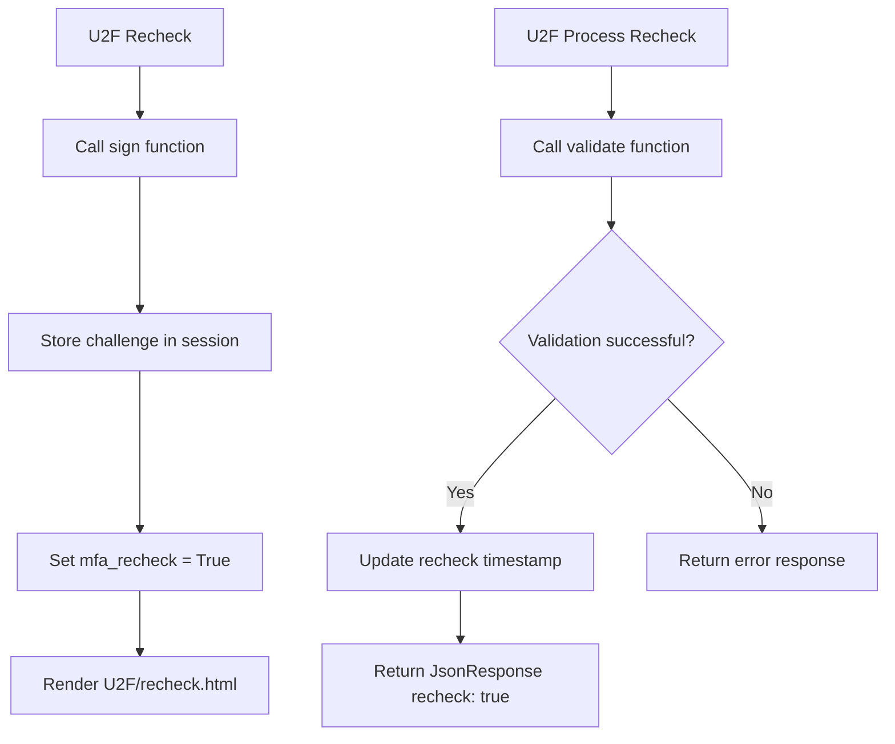
<br>
<br>
<br>

## 5. Recovery Codes MFA (recovery.py)

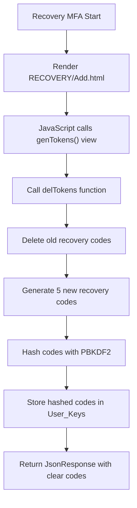

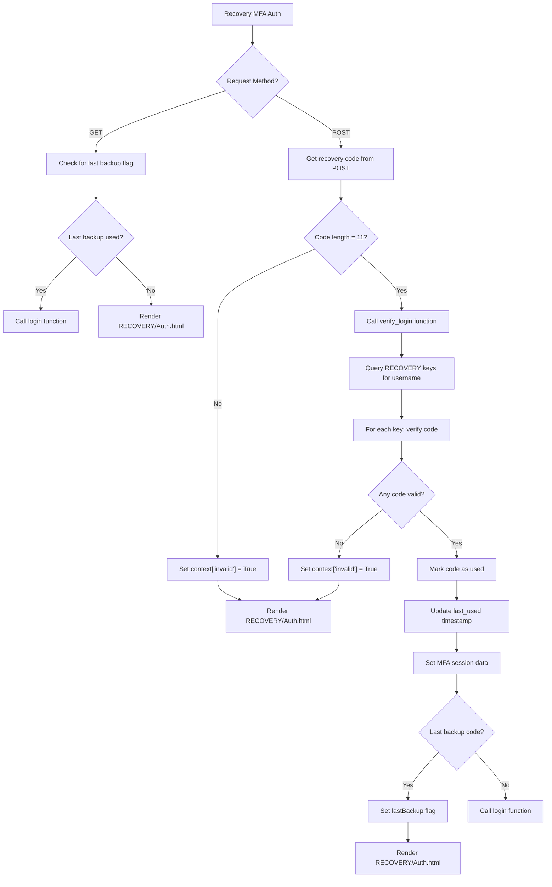

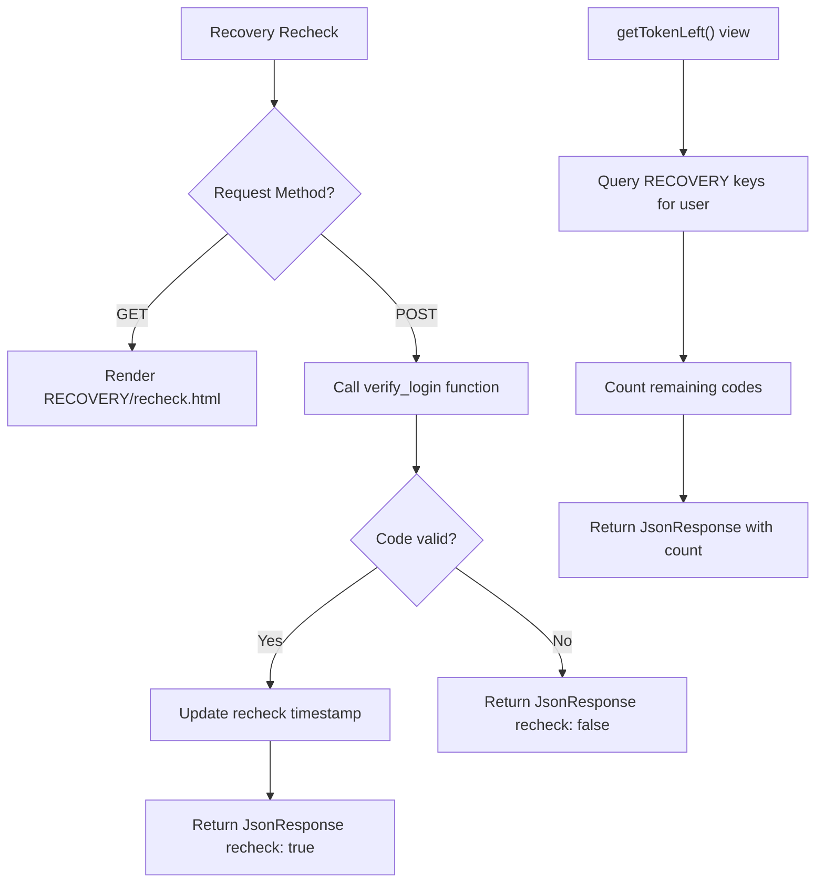
<br>
<br>
<br>

## 6. Trusted Device MFA (TrustedDevice.py)

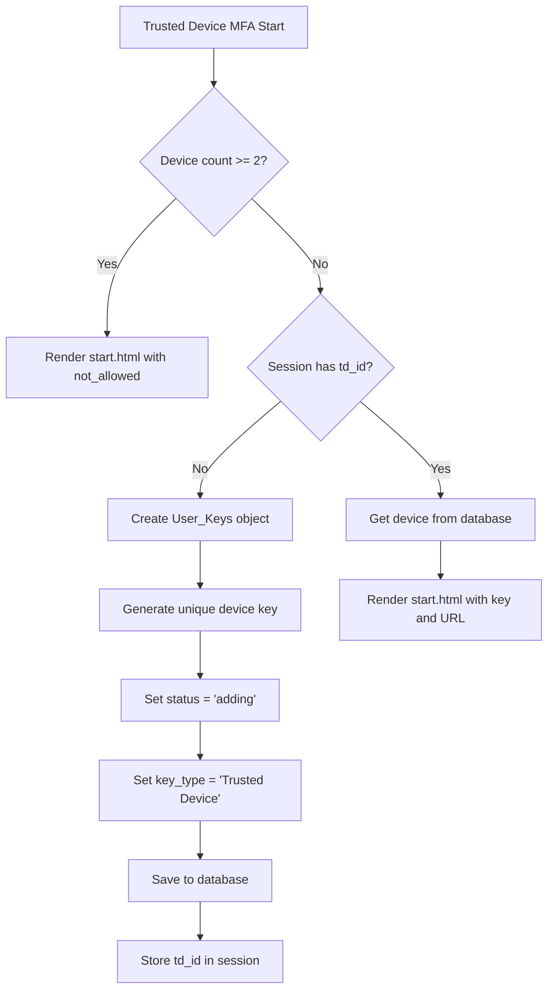

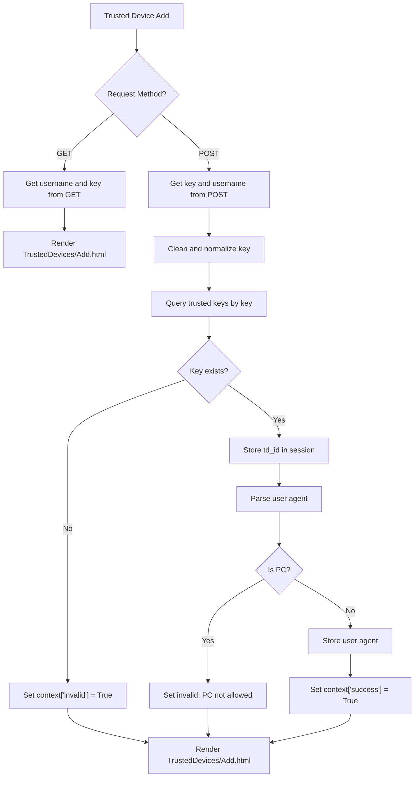

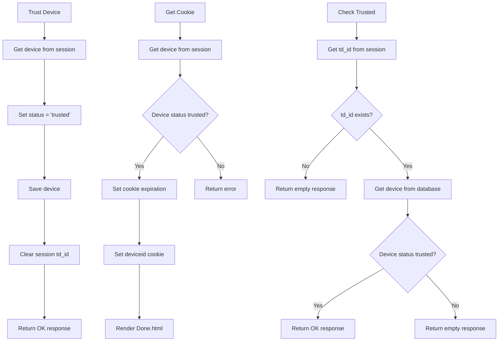

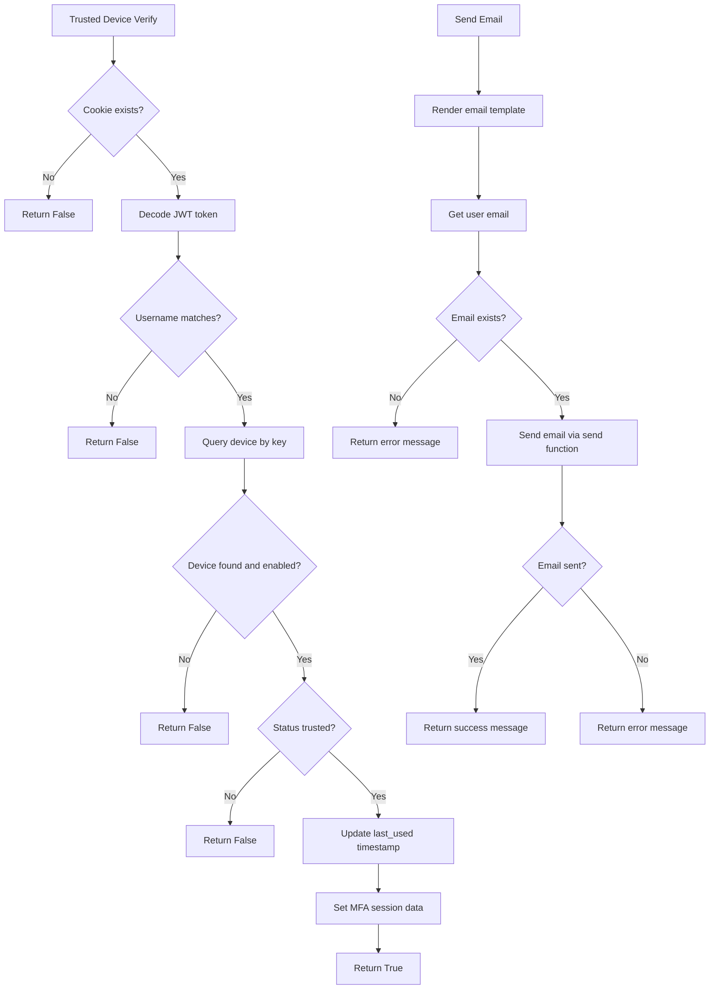
<br>
<br>
<br>

## 7. Overall MFA Flow (views.py)

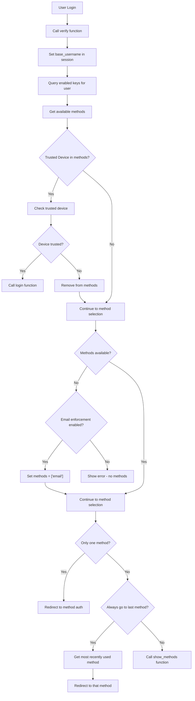

```mermaid
flowchart TD
    MFA_W["show_methods Function"] --> MFA_X["Render select_mfa_method.html"]
    MFA_X --> MFA_Y["Display available methods with rename"]
    MFA_Y --> MFA_Z["User selects method"]
    MFA_Z --> MFA_AA["Call goto function"]
    MFA_AA --> MFA_BB["Redirect to selected method auth"]

    MFA_CC["Method Authentication"] --> MFA_DD{"Method type?"}
    MFA_DD -->|TOTP| MFA_EE["Call TOTP auth"]
    MFA_DD -->|Email| MFA_FF["Call Email auth"]
    MFA_DD -->|FIDO2| MFA_GG["Call FIDO2 auth"]
    MFA_DD -->|U2F| MFA_HH["Call U2F auth"]
    MFA_DD -->|Recovery| MFA_II["Call Recovery auth"]
    MFA_DD -->|Trusted Device| MFA_JJ["Call Trusted Device auth"]

    MFA_EE --> MFA_KK["Verify authentication"]
    MFA_FF --> MFA_KK
    MFA_GG --> MFA_KK
    MFA_HH --> MFA_KK
    MFA_II --> MFA_KK
    MFA_JJ --> MFA_KK

    MFA_KK --> MFA_LL{"Authentication successful?"}
    MFA_LL -->|Yes| MFA_MM["Set MFA session data"]
    MFA_MM --> MFA_NN["Call login function"]
    MFA_LL -->|No| MFA_OO["Show error message"]
    MFA_OO --> MFA_PP["Return to method auth page"]
```

```mermaid
flowchart TD
    MFA_QQ["Login Function"] --> MFA_RR["Get MFA_LOGIN_CALLBACK setting"]
    MFA_RR --> MFA_SS["Call __get_callable_function__"]
    MFA_SS --> MFA_TT["Import callback module"]
    MFA_TT --> MFA_UU["Get callback function"]
    MFA_UU --> MFA_VV["Call callback with request and username"]
    MFA_VV --> MFA_WW["Return callback response"]

    MFA_XX["Key Management"] --> MFA_YY{"Action?"}
    MFA_YY -->|Delete| MFA_ZZ["Call delKey function"]
    MFA_YY -->|Toggle| MFA_AAA["Call toggleKey function"]
    MFA_ZZ --> MFA_BBB["Verify key ownership"]
    MFA_BBB --> MFA_CCC["Delete key"]
    MFA_CCC --> MFA_DDD["Return success message"]
    MFA_AAA --> MFA_EEE["Verify key ownership"]
    MFA_EEE --> MFA_FFF{"Key in HIDE_DISABLE?"}
    MFA_FFF -->|Yes| MFA_GGG["Return error: Can't change method"]
    MFA_FFF -->|No| MFA_HHH["Toggle enabled status"]
    MFA_HHH --> MFA_III["Return OK"]

    MFA_JJJ["reset_cookie Function"] --> MFA_KKK["Create redirect to LOGIN_URL"]
    MFA_KKK --> MFA_LLL["Delete base_username cookie"]
    MFA_LLL --> MFA_MMM["Return redirect response"]
```
